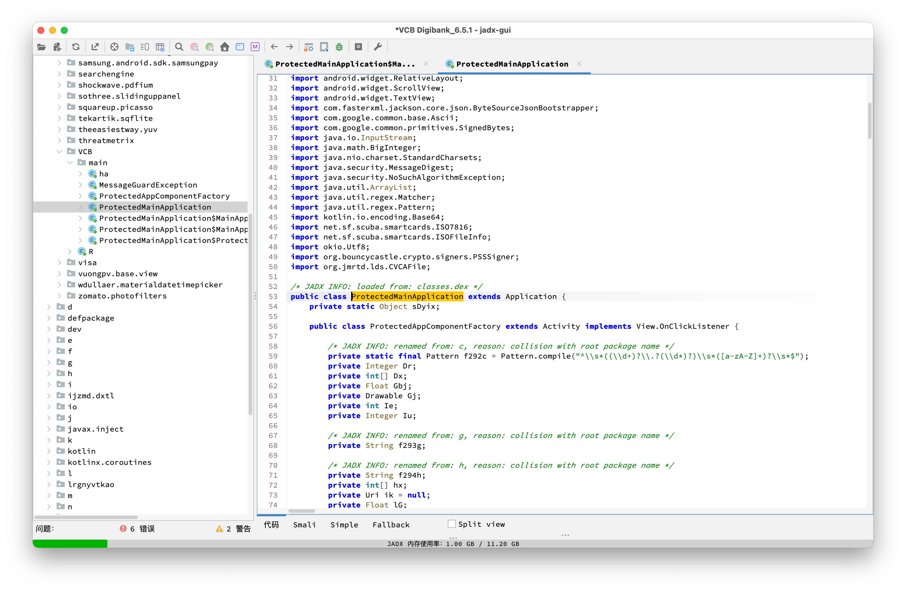
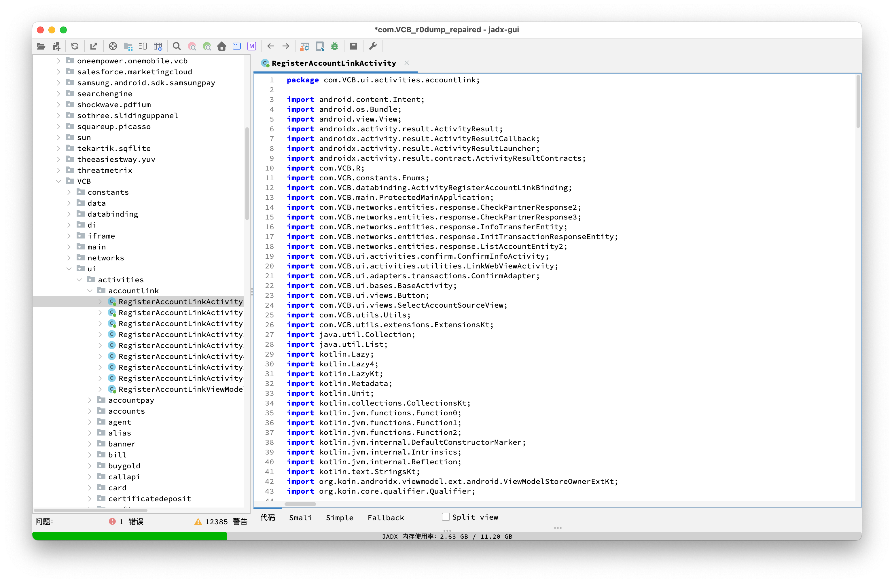

# R0DUMP

## 免责声明

⚠️ 该系统为适配 `oneplus 9` 的 `Android 16` 镜像，不能跨设备随意刷，变砖概不负责

⚠️ 该项目仅供学习交流使用，请在有测试授权的软件上使用该项目。使用者的任何行为与该项目开发者无关。

⚠️ use at your own risk.

## R0DUMP 是什么？

`R0DUMP` 是一个受 `FART` 项目启发，将经典主动调用脱壳思想迁移到基于 `android 16` 的脱壳定制 `lineage 23` 系统。该项目完整融合了旧 `FART` 的思想，并在此基础上做了更多增强，包括但不限于：

    1. 更安全的主动调用
    2. 更多适配 Android 16 的脱壳点
    3. 适配 Android 16 的落盘方案
    4. 异步队列 DUMP + ANR 保护
    5. 一个 GUI 管理器，集配置、监控、修复于一体

[R0DUMP 刷机包](https://r0dump.ivory.cafe/lineage-23.2-r0dump16-RELEASE-lemonade-releasekeys-mtless-20260711_184823.zip)
[R0DUMP 定制 GAPPS 刷机包](https://r0dump.ivory.cafe/r0dump_gapps_injected_images.zip)

## R0DUMP 如何使用？

### 准备

1. 准备一台已经解锁的 oneplus 9 设备
2. 下载最新的 R0DUMP 系统
3. (如果需要 Google 生态) 下载最新的 R0DUMP 定制 GAPPS 注入包

### 刷机

参考[教程](docs/R0DUMP%20刷机教程.md)刷入 R0DUMP 系统

### DUMP

1. 选择目标 APP
2. 选择需要使用的 DUMP 策略
3. 点击 DUMP 并喝杯咖啡等待
4. 修复

## 部分脱壳效果

脱壳前:

脱壳后:

## R0DUMP 是如何开发的？

详情移步看雪论坛: [r0dump](https://bbs.kanxue.com/thread-292107.htm)

该项目主要用于学习 `FART` 的运行时脱壳思路，并验证其在 `Android 16` / `LineageOS 23` 环境中的迁移可行性。

开发过程中使用了 `gpt-5.5`、`deepseek-v4-pro`、`Kimi K3` 辅助源码阅读、版本差异整理、代码修改、日志分析和文档整理。相关内容仍需结合实际 patch、编译结果、设备运行状态以及 dump / repair 结果进行核对。

该项目在持续优化完善中，~~后续整理完毕会放出 patch 包，届时可自行移植到其他机型。~~ (patch 包已更新)

## 致谢

感谢 `r0ysue` 老师的指导和建议

感谢 `寒冰冷月` 老师的 [`FART` 项目](https://github.com/hanbinglengyue/FART) 和 技术文章:

- [FART：ART环境下基于主动调用的自动化脱壳方案](https://bbs.kanxue.com/thread-252630.htm)
- [FART正餐前甜点：ART下几个通用简单高效的 dump 内存中 dex 方法](https://bbs.kanxue.com/thread-254028.htm)
- [拨云见日：安卓 App 脱壳的本质以及如何快速发现 ART 下的脱壳点](https://bbs.kanxue.com/thread-254555.htm)
